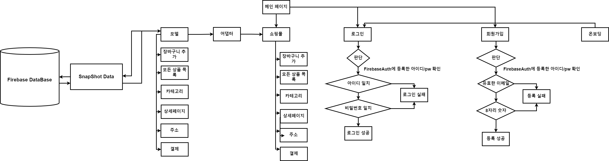

## MiniShop[미니 상점 어플리케이션]


## 개발 플로우 차트


## 프로젝트 요약
 
> 2022.10.06 - 2022.12.1   
 
> **Android 기말 과제 프로젝트**
* 안드로이드 기반의 이커머스 형태의 미니 샵 형태의 어플리케이션입니다.
* Model-Adapter-Activites(View)화면 구성 형태를 띄며, Firebase Database에 등록해 놓은 상품 데이터(snapshot data)를 앱 클라이언트에서 모델 형태로 가져옵니다.
* Firebase Auth과 Android를 연동하여 등록한 사용자에 대한 로그인/회원가입을 시도합니다.
* 장바구니, 상품 총 가격, 주소, 결제, 모든 상품 화면은 Recyclerview 형태로 ListView에서 발생할 수 있는 많은 수의 데이터 표시로 인한 성능 저하를 막아주도록 하였습니다.
* 실제 결제는 Razorpay API를 사용하였으나 클라이언트와 API 서버 간의 연동에 계속 실패하여 구현하지 못하였습니다.
<br>

## Dependency
```java
dependencies {
    implementation 'androidx.appcompat:appcompat:1.4.1'
    implementation 'com.google.android.material:material:1.5.0'
    implementation 'androidx.constraintlayout:constraintlayout:2.1.3'
    implementation 'com.google.firebase:firebase-common-ktx:20.0.0'
    implementation 'com.google.firebase:firebase-auth:21.0.1'
    implementation 'androidx.legacy:legacy-support-v4:1.0.0'
    implementation 'com.google.firebase:firebase-firestore:24.0.1'
    testImplementation 'junit:junit:4.+'
    androidTestImplementation 'androidx.test.ext:junit:1.1.3'
    androidTestImplementation 'androidx.test.espresso:espresso-core:3.4.0'

    //slider image
    implementation 'com.github.denzcoskun:ImageSlideshow:0.1.0'

    //Glide
    implementation 'com.github.bumptech.glide:glide:4.12.0'
    annotationProcessor 'com.github.bumptech.glide:compiler:4.12.0'

    //Razor payment method
    implementation 'com.razorpay:checkout:1.6.26'
}
```
## API 주소
https://razorpay.com/docs/api/

## 시연영상
https://www.youtube.com/watch?v=apfxd9pdLP0
